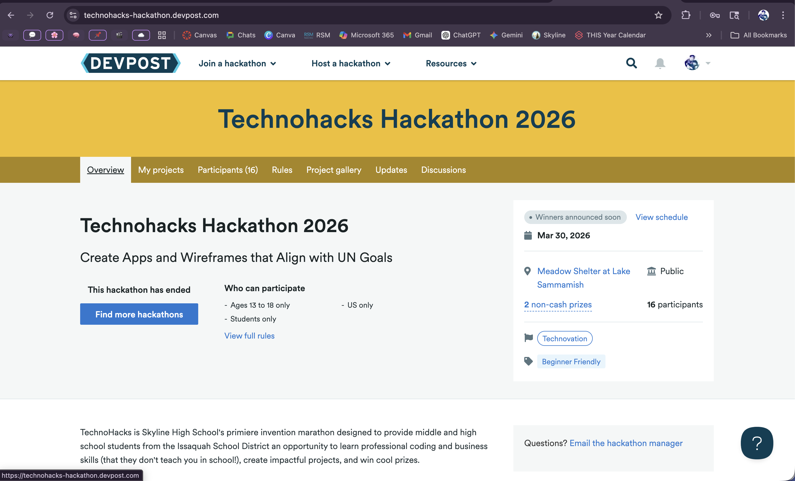

# Ambrosia

Ambrosia is a global health awareness and guidance web app inspired by **U.N. Sustainable Development Goal #3: Good Health and Well-Being**. The project is designed to help people learn about major illnesses, explore prevention strategies, and use a guided symptom workflow to receive safe, non-diagnostic next-step support.

This project focuses on making health information feel more approachable, visual, and easy to navigate. The goal is to combine education, prevention, and practical support in one warm, inviting experience.

## Project Purpose

Ambrosia was created to help users:

- explore major global health challenges
- learn about infectious diseases, chronic illnesses, maternal health, and common conditions
- review prevention strategies and warning signs
- search health topics and localized outbreak information
- use a guided symptom checker for practical next-step support

The app is educational and supportive, but it is **not a substitute for professional medical care**.

## Key Features

- `Explore` section for learning about major diseases and health topics
- `Apply` section for checking symptoms and receiving safe guidance
- detailed illness pages for conditions such as HIV/AIDS, tuberculosis, malaria, cardiovascular disease, cancer, diabetes, hypertension, asthma, maternal and neonatal health, and common illnesses
- localized area search support for outbreaks, travel notices, and exposure risks
- outbreak/news summary section
- age-aware symptom workflow
- optional photo upload step for symptom support
- warm pastel sunset visual design intended to feel calm and welcoming

## Built With

- HTML
- CSS
- JavaScript

## Project Structure

```text
ambrosia/
├── index.html
├── styles.css
├── script.js
├── ambrosia-logo.png
├── ambrosia-mark.png
└── conditions/
    ├── hiv-aids.html
    ├── tuberculosis.html
    ├── malaria.html
    ├── cardiovascular-disease.html
    ├── cancer.html
    ├── diabetes.html
    ├── hypertension.html
    ├── asthma.html
    ├── maternal-neonatal-health.html
    └── common-illnesses.html
```

## Hackathon Background

Ambrosia was created as part of the **Technohacks Hackathon 2026**.



From the event details shown in the hackathon page:

- theme: **Create Apps and Wireframes that Align with UN Goals**
- event date: **March 30, 2026**
- location: **Meadow Shelter at Lake Sammamish**
- participant eligibility: **ages 13 to 18**, **students only**, **US only**
- event tags included **Technovation** and **Beginner Friendly**
- total participants listed: **16**

Most importantly, this project won the **Best Overall** prize in the competition.

## Why This Project Matters

U.N. Goal #3 centers on reducing preventable deaths, improving maternal and child health, and addressing both infectious and chronic disease. Ambrosia turns that mission into a website experience that helps users understand health risks earlier and take prevention more seriously.

## Running The Project

This is a static website, so you can run it locally by opening `index.html` in a browser.

If you want a simple local server, you can also run:

```bash
python3 -m http.server
```

Then open `http://localhost:8000`.

## Future Improvements

- connect localized outbreak lookups to a live backend or API
- expand disease detail pages with more articles, visuals, and source links
- add stronger filtering by age, region, and risk factors
- improve accessibility and responsive behavior further
- add a more advanced symptom guidance engine with medically reviewed sources

## Note

Ambrosia is an educational and supportive project. It does not diagnose medical conditions and should not replace licensed medical advice or emergency services.
